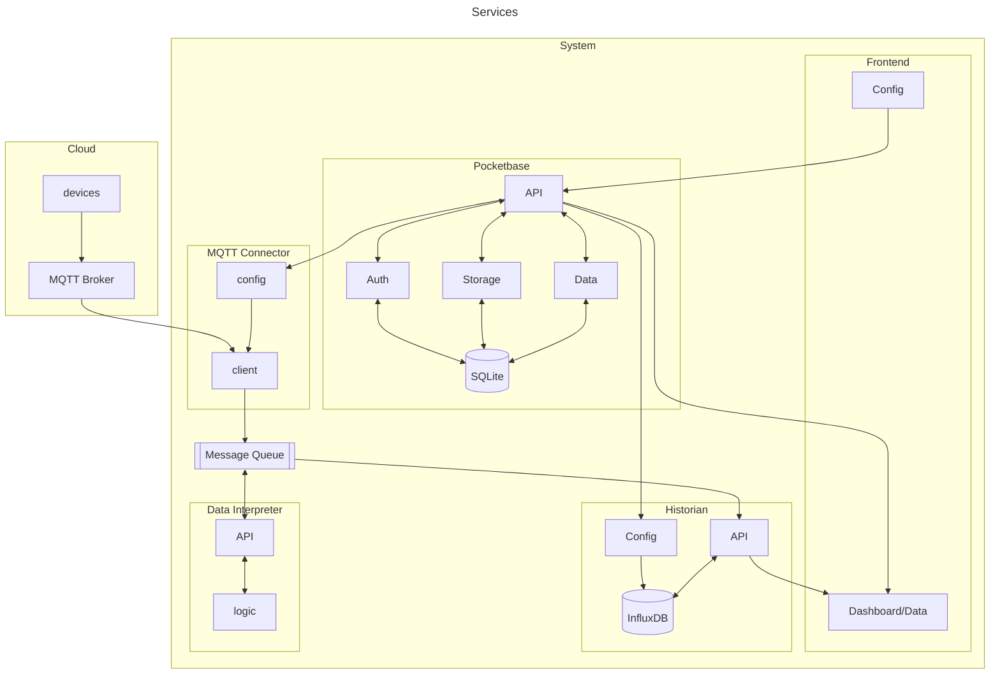

# Simple monolithic IOT Hub

This is a simple example on how to implement complex system logic with up to date tools. Not perfect at all but capable of doing lot of things..

## Architecture



<br>

# Run application

There is a docker-compose file provided to spin up all necessary services for this application. Just spin up the compose file.

```bash
docker compose up -d
```

Your services are available here:

- `Pocketbase Admin UI`: &emsp; http://localhost:8090/\_/ <br>
- `SigNoz UI`: &emsp; http://localhost:3301/

# Pocketbase

> Open Source backend for your next SaaS and Mobile app in 1 file

As of today, Pocketbase does not offer an official docker image on any remote registry. Therefor we need to manually build it.

## Build Docker image

```bash
docker build -t <username>/pocketbase:<tag> .
```

# SigNoz

> Opensource APM - Self Hosted Observability with Traces, Logs and Metrics in a single pane

Run SigNoz as an separate docker stack using the [official setup](https://signoz.io/docs/install/docker/#install-signoz-using-docker-compose) for docker compose.

```bash
git clone -b main https://github.com/SigNoz/signoz.git && cd signoz/deploy/
docker-compose -f docker/clickhouse-setup/docker-compose.yaml up -d
```

# Nuxt setup

Look at the [Nuxt 3 documentation](https://nuxt.com/docs/getting-started/introduction) to learn more.

## Setup

Make sure to install the dependencies:

```bash
# yarn
yarn install

# npm
npm install

# pnpm
pnpm install
```

## Development Server

Start the development server on http://localhost:3000

```bash
npm run dev
```

## Production

Build the application for production:

```bash
npm run build
```

Locally preview production build:

```bash
npm run preview
```

Check out the [deployment documentation](https://nuxt.com/docs/getting-started/deployment) for more information.
